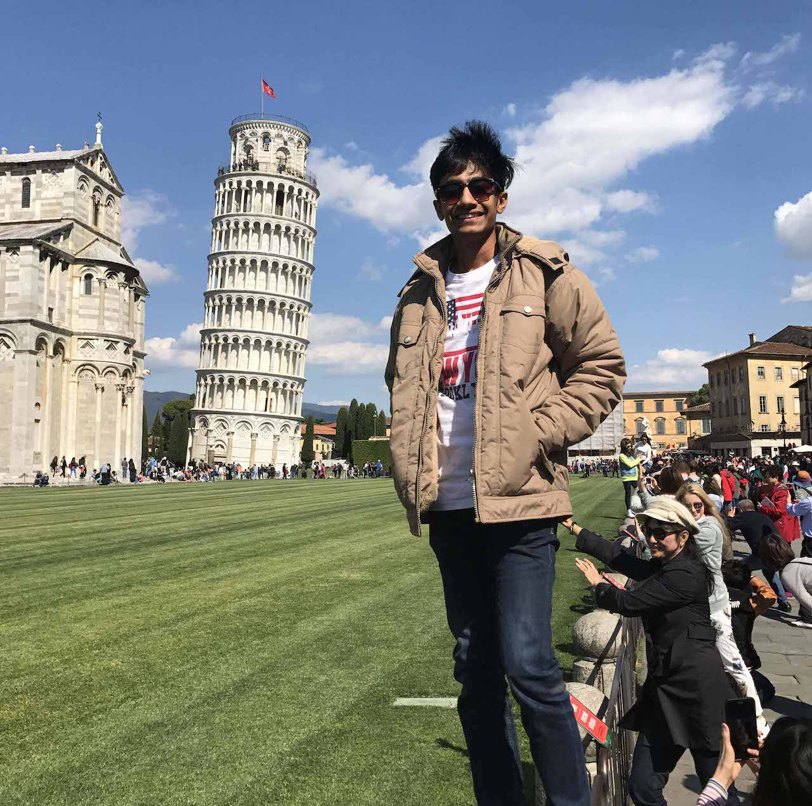

## About Me

Hi! I am Abhijay. I am a pre-final year student at Birla Institute of Technology and Science (BITS), Pilani, majoring in Mechanical Engineering. I am broadly interested in Robotics, particularly in Aeriel Robotics, UAVs, Motion Planning and Machine Learning.

I most recently worked as an Inderpendant researcher under [Hanna Hans](https://www.linkedin.com/in/hanna-hans-360a8718a/) at [Thynklogy](https://thynklogy.com). I focused on designing and developing an Autonomous UAV navigation and human detection algorithm. I also worked on existing Human Detection algorithms such as HOG and Haar Cascades, and UAV navigation algorithms such as FIESTA, Voxblox and Artificial Potential Fields. For the implementation, I made a simple CNN architecture to detect humans trained on the MIT Pedestrian Dataset.

I am currently working under [Prof. Solomon Raju](https://www.ceeri.res.in/profiles/kota-solomon-raju/) at the [CRIS Central Electronics Engineering Research Institute](https://www.ceeri.res.in) in Pilani, as a research Asistant. I worked on Sructural Health Monitoring using Machine Learning, mostly experimenting with 2nd order ODE to better capture the model curvature and matrix curvature analysis. Details can be found in my résumé/CV or under the projects section. 

I also interned at [Plastic Water Labs, Bangalore](http://www.plasticwaterlabs.com), a research lab, where I worked on a Defect Detection algorithms using Deep Learnging and Convolutional Neural Networks.

I am a huge fan of travelling, already visitefd 6 countries and counting! I am also a huge fan of TV series, having watched motly all of the popular sitcoms, sci fi and horror shows!! I am also a national level chess player and was the youngest one to win the uner 7 age categories in the states!

---

## Research Interest

My research interests primarily lie in the field of Robotics and machine learning, as well as their applications. I am fascinated by **Bipeds** and pretty much everything related to it, though I am slightly inclined towards researching on the human walking mechanismns as a tool for **Humanoid Robots** and that sparks my interest in **bipedal locomotion**. I have also developed an interest in **UAVs**, researching at the intersection of Robotics and computer vision.

---

## Positions of Responsibility

Post | Organization | Duration
--- | --- | ---
Core Member | [Committe of Students for Academic Activities](https://www.linkedin.com/in/costaa-apogee-bits-pilani-1b2267187/) | April 2018 - March 2019
Member | Student Faculty Council | August 2017 - December 2017

---
You can find the full source code of this site on [GitHub](https://github.com/Megh-Thakkar/Megh-Thakkar.github.io)

---
